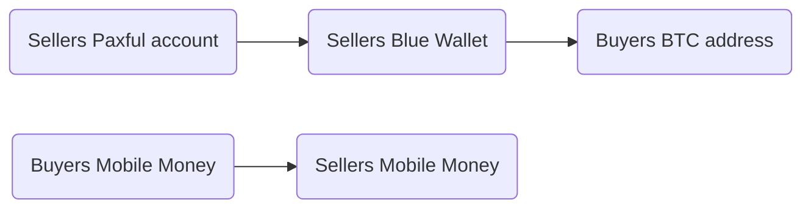

# RWANDA / RWF/ 🇷🇼

| Key               | Value     |
| ----------------- | --------- |
| [Location:](https://www.cia.gov/library/publications/the-world-factbook/geos/print_rw.html)         | Central Africa, east of the Democratic Republic of the Congo, north of Burundi          |
| [Capital City:](https://www.cia.gov/library/publications/the-world-factbook/geos/print_rw.html)     | Kigali                                                                                  |
| [Goverment Type:](https://www.cia.gov/library/publications/the-world-factbook/geos/print_rw.html)   | Presidential Republic                                                                   |
| [Border Countries:](https://www.cia.gov/library/publications/the-world-factbook/geos/print_rw.html) | Burundi 315 km, Democratic Republic of the Congo 221 km, Tanzania 222 km, Uganda 172 km |
| [Currency Code](https://en.wikipedia.org/wiki/Rwandan_franc)                                                 | RWF                                                                                     |
| [Symbol](https://en.wikipedia.org/wiki/Rwandan_franc)                                               | FRw, RF, R₣                                                                             |
| [Banknotes](https://en.wikipedia.org/wiki/Rwandan_franc)                                            | 500, 1000, 2000, 5000 francs                                                            |
| [Coins](https://en.wikipedia.org/wiki/Rwandan_franc)                                                | 1, 2, 5, 10, 20, 50 and 100 francs                                                      |
| [Users](https://en.wikipedia.org/wiki/Rwandan_franc)                                                | Rwandans                                                                                |
| [Central Bank](https://en.wikipedia.org/wiki/Rwandan_franc)                                         | [National Bank of Rwanda](https://www.bnr.rw/home/)                                     |

## Background

Since 2000, Rwanda has registered inclusive growth, averaging 8% annually leading to millions being lifted out of poverty and good progress in all development sectors.

The Government's progressive visions have been the catalyst for the fast transforming economy. The President of Rwanda, Paul Kagame, has noted his ambition to make Rwanda the "Singapore of Africa". [^economy]

Rwanda has made tremendous strides in improving electrification in the 21st century. A great number of new areas has become electrified through an expansion of infrastructure. [^economy]

## Demographics

[Population Distribution:](https://www.cia.gov/library/publications/the-world-factbook/geos/print_rw.html) 
   - one of Africa's most densely populated countries; 
   - large concentrations tend to be in the central regions and along the shore of Lake Kivu in the west
   
|      Year [^wittgenstein_centre] | Population Size | Gender | Population by Gender |
|:---------------:|:-----------------------:|:------:|:-------------------:|
|      2000       |          7965000          |  Male  |       3819300        |
|                 |                         | Female |       4146000        |
|      2020       |          13162000          |  Male  |       6461800        |
|                 |                         | Female |       6701000        |
| 2040 (forecast) |         19594700         |  Male  |       9651800        |
|                 |                         | Female |       9942900        | 

| Year [^w_meters] | Urban Pop % | Urban Pop | Rural Pop % | Rural Pop |
| ---------------- | ----------- | --------- | ----------- | --------- |
| 2000             | 15.1        | 1,197,920 | 84.9        | 6767.     |
| 2020             | 17.6        | 2,281,330 | 82.4        | 10880.    |
| 2040 (forecast)  | 23.2        | 4,562,582 | 76.8        | 15031.    |

- The link between urbanization and the creation of non-farm jobs is stronger in areas with a higher population density and better connectivity in terms of transport and access to markets. [^world_bank]

### [Language](https://www.cia.gov/library/publications/the-world-factbook/geos/print_rw.html)
   - Kinyarwanda (official, universal Bantu vernacular) 93.2%
   - French (official) 
   - English (official) 
   - Swahili/Kiswahili (official, used in commercial centers) 
   - Other 6.3%, 
   - Unspecified 0.3% (2002 est.)
   
## Education
Education has a big impact on different demographic structures, processes and behaviours. Education is highly connected to: 
- fertility 
- mortality 
- migrations[^w_centre]

Education is influencing other aspects of peoples lives and their behaviours next to ones listed above. 

When it comes to our research we didn't conduct any information about our participants education, reason for that is providing more information about them would make them easily identified. 

Interesting questions that we would like to answer in the future: 
- Spending behaviours based on education
- How people interact with money based on education 
- Does education affect amount of accounts people have 
- Saving behaviours based on education

## Rural Areas
- Most of the population lives in rural areas
- Some participants send money to family in rural areas
- Availability of financial services?
- Distance between finacial institution and some rural parts might be very long

## Using Bitcoin

### P2P Volumes
Bitcoin P2P market volumes in Rwanda according to [UsefulTulips](https://www.usefultulips.org/combined_RWF_Page.html) started in March 2017 when USD Equivalent Volume was 205 on LocalBitcoins.

Interest over time in Rwanda reached the highest in May 2019 and highest interest was in Southern Province in total. [^trends_google]. This also coincides with the highest volume of P2P trades in the country which happened on Paxful -- in Jun 2020 when it was 2.682 USD Equivalent Volume. 

:::success
#### Volumes in November 2020:
   1. LocalBitcoins: 3828 USD Equivalent Volume
   2. Paxful: 271 USD Equivalent Volume
:::

#### [LocalBitcoin Volumes](https://www.usefultulips.org/combined_RWF_Page.html)
- March 2017. to May 2019. volumes were in between 205 and 10.673 USD Equivalent Volume.
- From May 2019. to Jun 2019. volumes were moving from 32.388 up to 87.994 USD Equivalent Volume. 

#### [Paxful Volumes](https://www.usefultulips.org/combined_RWF_Page.html)
- Starting in August 2019 till December 2019 voulmes were in a range from 0 to 45 USD Equivalent Volume, when just a month after it reached 2.222 USD Equivalent Volume. 

### KYC / Address Verification
We attempted to use Paxful a P2P marketplace to exchange bitcoin to local currenceis, especially since the larger exchanges do not have buy/sell features in the country.

#### Challenges
- Address verification not possible 
- Not having a fully verified account put some limitations on the account
- Process didn't feel quick and smooth
- Uncertanity for format of the verification documents, pdf, jpg, etc... 
 
#### Process
- [x] Creating an account
- [x] ID Verification
- [ ] Address Verification

##### Verification
- ID Verification was smooth and very fast
- Address Verification was an issues since this participant doesn't have documents that have an address on it, utility bills usually come as an SMS, for example electricity is bought before it's used. 

> I will be getting a bank statement, because in Rwanda we don't have utility bills that include an address and most people don't have very specific home address, so a bank statement is the only option since Credit Cards are not a thing in Rwanda. The address is usually the street you live on,  but there are like 100 or 150 house on a street.

   > Just got the bank statement. There's no trace of an address. 

- Highiglights: 
   - Improving UX by providing alternative options and making the verification process suitable for all countries where services are available 
   - Consider alerternative options for people without utilitie bills, rent or bank statements 
   - Proof of address is required when a user reaches his trading limits 
  - Take into consideration drivers license as a proof of address (POA) 
    
- Learnings: 
We have learned that process can be long and tedious for some verification steps, address verification might not be possible for everyone in Rwanda like it wasn't for this participant. 

#### Outcome
- ID verification was successful
- Address verification was not successful
- Bank transfer not possible because there is no address verification

### Finding Buyers
One usecase for bitcoin currently is for international settlements especailly for low value amounts it can be more cost/time efficeint than a bank transfer.

#### Challenges

Some challenges that local sellers may face.

- No buyers on Paxful to buy BTC with Mobile Money
   - Closest buyer for Mobile Money was in Kenya for MPESA
      - This creates more challenges because participant wasn't willing to create a new account with MPESA and was trying to avoid being charged any aditional fees 

- Trying to find a buyer through contacts and friends, posted a WhatsApp Story, a buyer reached out

   - Buyers found this way were not really reliable
   - First buyer disappeared 
   - Buyers don't give an impression of someone you can do business with
   - Payment method issues 
      - Available offer for a bank transfer, but address verification is required
      - PayPal can't be connected to the bank account and money can't be withdrawn from PayPal account 
      - No available offers for Mobile Money on Paxful
- Process: 
- [x] 3 Step Confirmation
- [x] Finding a buyer 
- [x] Converting BTC to local currency

- Process for selling BTC and receiving a payment from a buyer: 

- Highlights:
There was a need to reach out outside of P2P marketplace in order to find buyers and some transactions had to be made outside of Paxful because of high fees. 

- Learnings: 
   - Difficulties of finding buyers
   - Difficulties of selling BTC
   - Payment methods not available 
   - High fees for transfering money from a Paxful account to a non-Paxful account

#### Outcome
- It was not possible to find buyers on Paxful
- Buyers were found through sellers own network after a social media post
- High fees on Paxful made people to find alternative ways for conversion 

### Finding Sellers
- N/A
---

### SWOT Analysis
- STRENGTHS
   - Faster domestic and international transactions
   - Anonymity
- WEAKNESSES
   - Transactions fees
   - Risk of losing private keys
   - Bad internet connection
- OPPORTUNITIES
   - Push towards cashless society
   - Lower fees on lightning network
- THREATS
   - ...
## Payments
### [MVISA PROJECT](https://www.researchgate.net/publication/313781027_MAPPING_MOBILE_MONEY_IN_RWANDA_THE_MVISA_PROJECT/link/58a5ddf3aca27206d9915a15/download)
   - Visa was the first credit card company to enter Rwandan Market in 2012
   - Bank of Kigali and Visa launched MVISA in 2013, a digital wallet that targets 55% of entire Rwandas population that has mobile phones
   - MVISA goal is to provide easy access for account holders and non-account holders 
   - With MVISA people are able to:
      - benefit from digital payments
      - have a convenience of accessing their account without going to the bank 
      - being able to easily transfer money through their phone
      - works across different financial institutions and mobile phone networks [^IFC] 
> Rwanda has Lower levels of mobile phone ownership and technical literacy than its neighbors. Mobile phone ownership and access is lower in rural areas, among women and for those living below the poverty line. [^IFC] 

:::info
Rwanda’s regulation and policies promote digital financial services and discourage the use of cash. Financial inclusion in the country has shown significant improvement in the last 4 years, primarily because of mobile money. However, the financial sector currently does not offer competitive agent banking solutions. Market participants all agree that strong customer education and marketing is required. [^IFC]
::: 

### Who are the players now (a summary of the money services we discovered in personas)
   - MTN Mobile Money 
   - Airtel
   - Bank of Kigali 
   - Equity Bank
   - Nokanda
   - Tigo
   - MPESA

### Goverments push for mobile money and digital payments

[VISION 2020](https://en.wikipedia.org/wiki/Vision_2020_(Rwanda))

Vision 2020 was launched by Rwandan President Paul Kagame in 2000s.
Goal was to reduce poverty and health issues, transform Rwanda into a middle-income country and achive skilled human capital, including education, health and information technology.

[MOBILE MONEY IN RWANDA OVERVIEW](https://www.ifc.org/wps/wcm/connect/14a3397c-990f-4022-89ff-6f775af8e9c4/Rwanda+Market+Scoping+Report.pdf?MOD=AJPERES&CVID=mCsSsm3)

Challenges:
- Education
   - Unaware of Mobile Money
   - Unawareness that Mobile Money can be accessed without a smart phone 
   - Unable to locate an agent
   
| Key Statistics         | 2011        | 2015          |
| ---------------------- | ----------- | ------------- |
| Number of Subscribers  | 639.674     | 7,663,199     |
| Number of Transactions | 3.4 million | 168.6 million |
| Number of Agents       | 1,387       | 40,467        |

### Central Bank Digital Currency (CBDC)

> There are still concerns about how exactly you convert the entire currency into digital form, how to distribute that and how fast can you process those transactions. Challenges come in, if technology is down, how do you deal with such issues? We will join in once we are ready.

Peace Masozera Uwase, Financial Stability Director - General

> Blockchain, just like the whole list of fourth industrial revolution technologies is one of the areas that we are very supportive as a government and how we build that industry and grow it over time.

Paula Musoni, Minister, ICT and Innovation

### Community
- https://builtwithbitcoin.org/#journey
- https://news.bitcoin.com/paxful-completes-second-school-in-rwanda-builtwithbitcoin/
- https://www.africatechsummit.com/kigali/cth_speaker/norbert-haguma/
- https://www.youtube.com/watch?v=4pritHe2pV0
- https://cointelegraph.com/news/rwanda-blockchain-school-to-launch-in-2020-for-devs-professionals
- https://www.facebook.com/bitCoinRwanda/

### Other
- https://www.newtimes.co.rw/news/blockchain-technology-rise-rwanda

### Bitcoin Services
- [ ] Connect with local bitcoin communities to gather information about local bitcoin services

## REF

[^w_centre]: http://www.wittgensteincentre.org/en/research-themes-groups/education.htm
[^economy]: (https://en.wikipedia.org/wiki/Economy_of_Rwanda)
[^wittgenstein_centre]: http://dataexplorer.wittgensteincentre.org/wcde-v2/
[^world_bank]: https://www.worldbank.org/en/country/rwanda/publication/leveraging-urbanization-for-rwandas-economic-transformation
[^w_meters]: https://www.worldometers.info/world-population/rwanda-population/
[^trends_google]: https://trends.google.com/trends/explore?date=2016-02-01%202020-11-10&geo=RW&q=bitcoin
[^IFC]: https://www.ifc.org/wps/wcm/connect/14a3397c-990f-4022-89ff-6f775af8e9c4/Rwanda+Market+Scoping+Report.pdf?MOD=AJPERES&CVID=mCsSsm3

- https://arxiv.org/abs/1901.06249
- https://www.coindesk.com/rwandas-central-bank-is-researching-a-possible-digital-currency-launch
- https://bitcoinke.io/2019/12/rwanda-government-supporting-blockchain/

- Goverments push for mobile money and digital payments.
    - https://twitter.com/RURA_RWANDA/status/1311971981496123392
    - "The internet subscriptions per 100 inhabitants grew from 51.6% at the end of June 2019 to 62.3% as of June 30, 2020." -- [source](https://twitter.com/RURA_RWANDA)
