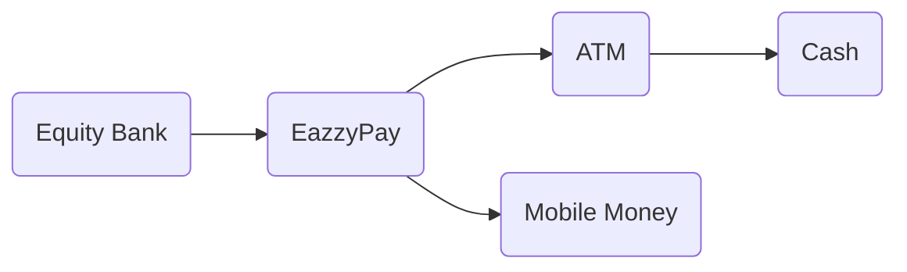

| Profile & Work                |                    |
| ----------------------------- | ------------------ |
| Location                      | Rwanda             |
| Job                           | Employed Full Time |
| Payment Frequency             | Monthly            |
| Hours Per Day                 | 8                  |
| COVID19  impact on Work Hours | No                 |
| Side Hustle                   | Yes                |
| Business Partners             | /                  |
| Dependents                    | 2                  |
| Technical Knowhow (1-10)      | 6                  |

## Store of Value & Payments 

### Behaviors

- Receives salary on Equity Bank account, before COVID-19 for daily transactions money is usually being transferred to Mobile Money or withdrawn and held in cash, now it's mostly Mobile Money
> I do prefer paying cashless. It's weird even though there's charges, but if you have cash in hand you risk losing it and so I do really prefer cashless transfer.
- Doesn't have an ATM card, but has EazzyPay with Equity bank
- Planning on getting an ATM card even though there are charges
- Has an account with another bank that is not being used 
- Spending's are planned
- Borrowing money to friends or family through Mobile Money, those loans get paid back through Bank Account or Mobile Money
> - When someone borrows money and someone asks you for 20K you might have to put 21K  because there are fees that need to be paid
- Takes loans from Mobile Money (MoCash)
- Mobile Money holds the biggest amount of money
- Never transferred money with Airtel or Tigo

BED.MONEY NOTES
<small> This participant has confirmed something we found interesting in other user personas and that is that they have never experienced to send money to someone who is using a different provider, like Airtel or Tigo.</small>

 <small>Examples</small>
:::spoiler
[Participant 1](https://hackmd.io/04RB3mjmTZGrsUa2_ohCng)
[Participant 8](https://hackmd.io/EvD2QLufSAqa--nhqhOjeQ)
[Participant 11](https://hackmd.io/repBXgLySJqCVG0aLY0e_w)
:::

| Preferences                 |                                   |
| --------------------------- | --------------------------------- |
| Store                       | Bank Account, Mobile Money, Cash  |
| Primary Store of Value      | Bank Account, Mobile Money        |
| Spending Wallet             | Mobile Money                      |
| High Value Transactions     | Mobile Money                      |
| High Value                  | >50.000                           |
| Digital Banking             | No                                |
| Preferred Payment Method    | Mobile Money                      |
| Fees                        | Doesn't like fees on Mobile Money |
| Money Management Strictness | 7                                 |
| Money Mindset               | [Achievers]                       |

### Conveniences

- Likes the convenience of Mobile Money agents being everywhere 
- Withdrawing money from Equity Bank with EazzyPay on the ATM

Transferring money from Equity Bank 

- Also using EazzyPay to transfer money to accounts in different banks
- When borrowing money to friends and family or from them, money is expected to be paid back in 30 days

### Frustrations

- Irritated by Mobile Money fees
- Having cash in hand is not safe, there is a risk of losing it
- Connection problems when it comes to transferring money with the bank
- Having a lot of money on Mobile Money account increases desire for spending and withdrawing

### Money Management

- Spending's are planed
- Prefers to save money in a bank account to avoid overspending
- After receiving a salary, spending's are calculated and only needed amount is being transferred to MTN Mobile Money
> First, after being paid my salary, I do schedule for the expenses I have to make. So I estimate the amount of money I need for the coming month. Then I transfer the whole amount to the mobile money.
- Money that is not meant for spending is kept in a bank account
- Uses EazzyPay to keep track of expenses on Equity Bank Account
- Uses Excel Sheets to keep track of income & spent money in all accounts

## Privacy, Security & Backups

| Tech Specs                  |                |
| --------------------------- | -------------- |
| Phone Model                 | Techno Spark 3 |
| Phone OS                    | Android        |
| SD Card                     | No             |
| Previously Lost Phone       | Yes            |
| Desktop/Laptop              | Unknown        |
| Email Addresses             | >1             |
| Cloud Provider              | Google Drive   |
| Cloud Storage Capacity (GB) | 15 GB          |
| Storage Cost                | Free           |
| Out of Space Warnings       | No             |

### Behaviors

- When an app asks for a sign up, usually uses email address
- Doesn't think that singing up with a phone number is more personal
> IF AN APP ASKS YOU FOR A PHONE NUMBER DO YOU HESITATE?
>
> - No, cause the phone number it's not something more personal. Mm, I mean I prefer email.
- Plans on getting an SD card
- Would provide phone PIN to family and friends 
- Wouldn't give the PIN to the person fixing the phone, but would put it in for them

### Conveniences

- Email is more convenient for singing up for an account
- When a phone runs out of space usually would delete photos and WhatsApp videos

### Frustrations

- Worried that a person fixing the phone might misuse the PIN
- Lost photos, contacts, videos and documents, because of lack of knowledge about backups

> - I lost a phone two years back and at that time, I didn't know that you can, you can save your contacts, photos, videos. But now I save my contacts on Google account. So if I lost a phone, I can find it on my email.

[Achievers]: https://mindsets.fjordnet.com/the-four-money-mindsets/achievers