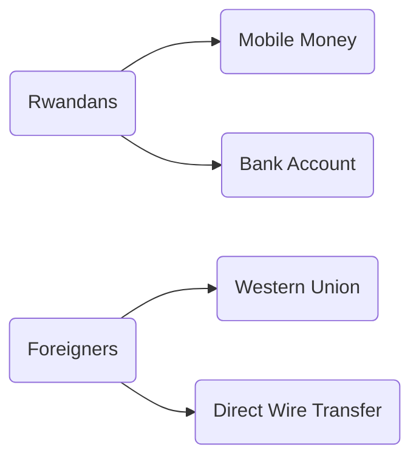

| Profile & Work                |                  |
| ----------------------------- | ---------------- |
| Location                      | Rwanda           |
| Job                           | Full Time Salary |
| Payment Frequency             | Monthly          |
| Hours Per Day                 | 8                |
| COVID19  impact on Work Hours | 0                |
| Side Hustle                   | Yes              |
| Business Partners             | /                |
| Dependents                    | 1                |
| Technical Knowhow (1-10)      | 7                |

## Store of Value & Payments 

### Behaviors

- Keeps the majority of the salary in a Bank Accounts and uses MTN Mobile Money for day-to-day transactions
- Spent 3 months without using cash
- In some cases may opt for cheapness over convenience
- Has a side hustle to bring in additional revenues

> IN YOUR SIDE BUSINESS, HOW DO YOUR CUSTOMERS PAY YOU?
>

> What I do is translation services for different clients in Rwanda, and elsewhere in the world. So there are different ways they pay me. Rwandan people, pay me through mobile money and bank accounts. Abroad, they sometimes use Western union and some others wire directly to my local bank account.
- Saves regularly
- Pays for siblings school
- Takes informal loans from a few friends, usually takes 2-4 weeks to repay a loan, depending mostly on when receives a salary
- Uses MTN Mobile Money often but dislikes the new charges the provider have placed on transactions
- Only has a debit card that uses for online purchases, instead of a credit card
- Would prefer to pay the rent via wire transfer
- Has Internet Banking, but doesn't know how to use it, but uses Mobile Banking
> How do you transfer money to someone through the Bank Account?
>
> - I go to the bank physically and do the transfer or withdraw money at the ATM and go to an agent to send the money, especially if it's a different bank.

- Because of COVID-19 most used payment method is Mobile Money, Bank Account and at the end Cash
- Never experienced to send money to someone who uses a different provider, everyone uses MTN

BED.MONEY NOTES
<small> This participant has confirmed something we found interesting in other user personas and that is that they have never experienced to send money to someone who is using a different provider, like Airtel or Tigo.</small>

 <small>Examples</small>
:::spoiler
[Participant 3](https://hackmd.io/B2ctPKllRj6wmUaTwNc9rw)
[Participant 8](https://hackmd.io/EvD2QLufSAqa--nhqhOjeQ)
[Participant 11](https://hackmd.io/repBXgLySJqCVG0aLY0e_w)
:::

| Preferences                 |                                                              |
| --------------------------- | ------------------------------------------------------------ |
| Store                       | Personal Bank Account, Company Bank Account, Cash, MTN Mobile Money |
| Primary Store of Value      | Personal Bank Account                                        |
| Spending Wallet             | MTN Mobile Money, Debit Card                                 |
| High Value Transactions     | Personal Bank Account                                        |
| High Value                  | >50.000                                                      |
| Digital Banking             | USSD Mobile Banking                                          |
| Preferred Payment Method    | Cash                                                         |
| Fees                        | Cares about fees, but likes the speed and convenience of mobile money for local payments |
| Money Management Strictness | 8                                                            |
| Money Mindset               | [Experiencers]                                               |

### Conveniences

- Prefers using cash, and says having cash on hand does not increase spending behavior

> It's all of the same to me. If I have money on my mobile money, credit card or bank cards. I use them as much as I use cash. If I want to buy something online. I can use a card or if I want to order something from Vuba Vuba or in other places they can pay by cash or mobile money or bank. So the same.

> WHY IS CASH THE BEST PAYMENT METHOD? 
> - Hey, we are talking about money here. If there is a way to send and receive money without being charged any fees, I would always choose that.
>
- Paying for small transactions with cash 

> It's more convenient to pay with cash for small transactions, sometimes you have to go out and maybe you want to buy something from a street salesman like fruits and vegetables. In those cases you have to use cash because they don't understand how Mobile Money works.

- In some situations paying with Mobile Money is easier

> With Mobile Money you send only what you need to send. Mobile Money is easier definitely before you finish the ride you can ask the driver for his phone number and by the time you get to your destination you can just walk away. You don't have to be stuck and wait for change.

### Frustrations

- Dislikes waiting for market vendors or motor drivers to get change and doesn't trust handing over cash if they don't have change
- Won't borrow from banks because getting in debt to them is scary
- Fear of someone running away with your money while waiting for change
- Fees when it comes to transferring funds via Mobile Money, Mobile banking has the same procedure and causes the same frustrations 

### Money Management

- Using notes on the phone to keep track of expenses and who owes money

## Privacy, Security & Backups

| Tech Specs                  |              |
| --------------------------- | ------------ |
| Phone Model                 | Samsung A80  |
| Phone OS                    | Android      |
| SD Card                     | Unknown      |
| Previously Lost Phone       | Yes          |
| Desktop/Laptop              | Yes          |
| Email Addresses             | <1           |
| Cloud Provider              | Google Drive |
| Cloud Storage Capacity (GB) | 15           |
| Storage Cost                | Free Tier    |
| Out of Space Warnings       | Never Seen   |

### Behaviors

- Is conscious about pin security
- Backup and Storage is not on top of mind
- Would put the pin for a person fixing the phone
- Contacts and photos were backed up on Google Drive

> WHAT DO YOU DO WHEN AN APPLICATION YOU HAVE JUST DOWNLOADED ASKS YOU FOR YOUR PHONE NUMBER?
>
> - There are these apps that you know, for sure that they need it, you always understand the logic behind it. Otherwise I don't provide it, but if it's a social media app like Twitter or Instagram, I know for a fact they will need it to generate my contacts and make me communicate with people. That's why they need my contact information. If it is a dictionary, come on. Why do you need my names and things to give me a dictionary?

### Conveniences

- When storage runs out of space, data would be transferred to other accounts or Dropbox
- Would be willing to create a new Gmail account in order to avoid having to pay for more storage for Google Drive
- Sometimes uses a computer to backup information from Google Drive
- For writing reviews on Google Maps received 500 GB 

> WHAT WOULD YOU DO IF YOUR GOOGLE CLOUD RUNS OUT OF SPACE?
>
> - That's hasn't reached there yet. I can figure out something when that happens. I would go back and delete some things or transfer some of my things to some of the other accounts. You know, there are so many other ways you can, can have them online. Someone can even have 2 Gmail accounts or use Dropbox.

### Frustrations

- Doesn't understand why certain apps that are not social media ask for a phone number

[Experiencers]: https://mindsets.fjordnet.com/the-four-money-mindsets/experiencers